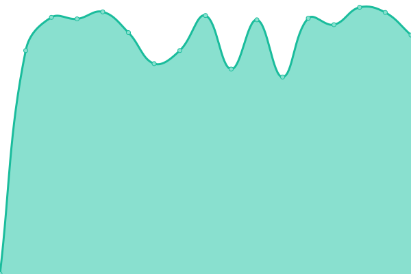
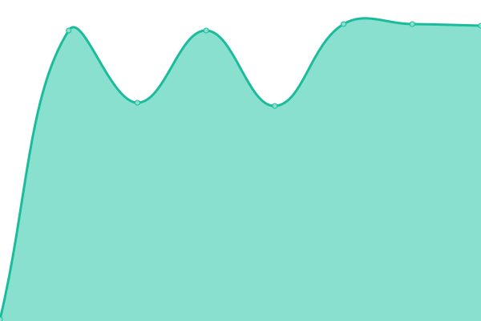
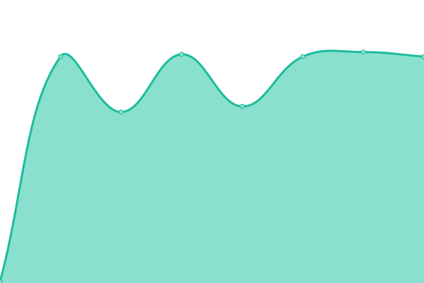
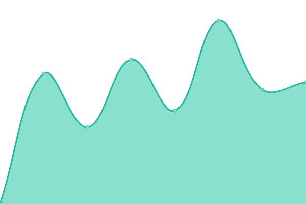
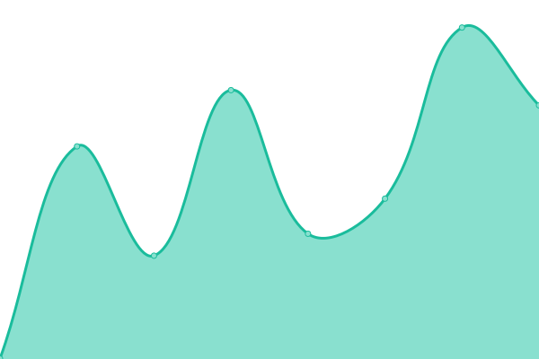

# [📈 Live Status](https://Master-Hash.github.io/upptime-service): <!--live status--> **🟧 Partial outage**

This repository contains the open-source uptime monitor and status page for [Hash](https://Master-Hash.github.io/upptime-service), powered by [Upptime](https://github.com/upptime/upptime).

With [Upptime](https://upptime.js.org), you can get your own unlimited and free uptime monitor and status page, powered entirely by a GitHub repository. We use [Issues](https://github.com/Master-Hash/upptime-service/issues) as incident reports, [Actions](https://github.com/Master-Hash/upptime-service/actions) as uptime monitors, and [Pages](https://Master-Hash.github.io/upptime-service) for the status page.

<!--start: status pages-->
<!-- This summary is generated by Upptime (https://github.com/upptime/upptime) -->
<!-- Do not edit this manually, your changes will be overwritten -->
<!-- prettier-ignore -->
| URL | Status | History | Response Time | Uptime |
| --- | ------ | ------- | ------------- | ------ |
|  [Naïveproxy](https://caddy2.hash.memorial) | 🟥 Down | [naiveproxy.yml](https://github.com/Master-Hash/upptime-service/commits/HEAD/history/naiveproxy.yml) | 

 0ms
     
 | 

<a href="https://Master-Hash.github.io/upptime-service/history/naiveproxy">0.00%</a>
    

|  [Cochatter](https://cochatter.azurewebsites.net) | 🟩 Up | [cochatter.yml](https://github.com/Master-Hash/upptime-service/commits/HEAD/history/cochatter.yml) | 

 965ms
     
 | 

<a href="https://Master-Hash.github.io/upptime-service/history/cochatter">100.00%</a>
    

|  [RSSHub](https://hash-rsshub.azurewebsites.net) | 🟩 Up | [rss-hub.yml](https://github.com/Master-Hash/upptime-service/commits/HEAD/history/rss-hub.yml) | 

 845ms
     
 | 

<a href="https://Master-Hash.github.io/upptime-service/history/rss-hub">100.00%</a>
    

|  [kladder](kladder.azurewebsites.net) | 🟩 Up | [kladder.yml](https://github.com/Master-Hash/upptime-service/commits/HEAD/history/kladder.yml) | 

 185ms
     
 | 

<a href="https://Master-Hash.github.io/upptime-service/history/kladder">100.00%</a>
    

|  [magicladder](magicladder.azurewebsites.net) | 🟩 Up | [magicladder.yml](https://github.com/Master-Hash/upptime-service/commits/HEAD/history/magicladder.yml) | 

 201ms
     
 | 

<a href="https://Master-Hash.github.io/upptime-service/history/magicladder">100.00%</a>
    

|  [pladder](pladder.azurewebsites.net) | 🟩 Up | [pladder.yml](https://github.com/Master-Hash/upptime-service/commits/HEAD/history/pladder.yml) | 

 201ms
     
 | 

<a href="https://Master-Hash.github.io/upptime-service/history/pladder">100.00%</a>
    

|  [gateway](gateway.hash.memorial) | 🟥 Down | [gateway.yml](https://github.com/Master-Hash/upptime-service/commits/HEAD/history/gateway.yml) | 

 422ms
     
 | 

<a href="https://Master-Hash.github.io/upptime-service/history/gateway">0.00%</a>
    

|  [assets](assets.hash.memorial) | 🟥 Down | [assets.yml](https://github.com/Master-Hash/upptime-service/commits/HEAD/history/assets.yml) | 

 197ms
     
 | 

<a href="https://Master-Hash.github.io/upptime-service/history/assets">0.00%</a>
    

|  [chatbot](chatbot.hash.memorial) | 🟩 Up | [chatbot.yml](https://github.com/Master-Hash/upptime-service/commits/HEAD/history/chatbot.yml) | 

 290ms
     
 | 

<a href="https://Master-Hash.github.io/upptime-service/history/chatbot">0.00%</a>
    

|  [pastebin](pastebin.hash.memorial) | 🟩 Up | [pastebin.yml](https://github.com/Master-Hash/upptime-service/commits/HEAD/history/pastebin.yml) | 

 245ms
     
 | 

<a href="https://Master-Hash.github.io/upptime-service/history/pastebin">0.00%</a>
    

|  [uptime](uptime.hash.memorial) | 🟥 Down | [uptime.yml](https://github.com/Master-Hash/upptime-service/commits/HEAD/history/uptime.yml) | 

 0ms
     
 | 

<a href="https://Master-Hash.github.io/upptime-service/history/uptime">0.00%</a>
    

<!--end: status pages-->

[**Visit our status website →**](https://Master-Hash.github.io/upptime-service)

## 📄 License

- Powered by: [Upptime](https://github.com/upptime/upptime)
- Code: [MIT](./LICENSE) © [Anand Chowdhary](https://anandchowdhary.com), supported by [Pabio](https://pabio.com)
- Data in the `./history` directory: [Open Database License](https://opendatacommons.org/licenses/odbl/1-0/)
